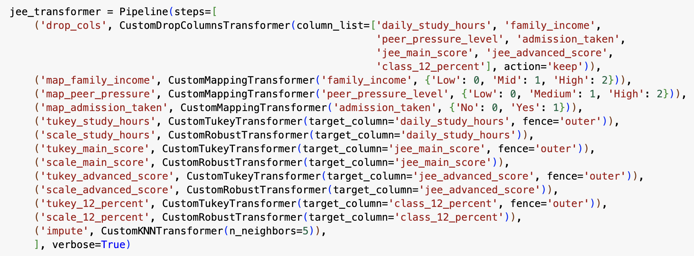

# JEE Data Pipeline Documentation

## Pipeline Overview

This pipeline preprocesses the JEE dataset to prepare it for machine learning modeling. It includes feature selection, categorical encoding, outlier detection and treatment, feature scaling, and missing value imputation.

Feature selection was performed using correlation matrix analysis and LightGBM feature importance to retain only the most relevant predictors.

---

## Pipeline Diagram

---

## Step-by-Step Design Choices

### 1. Column Selection (`drop_cols`)
- **Transformer**: `CustomDropColumnsTransformer(column_list=['daily_study_hours', 'family_income', 'peer_pressure_level', 'admission_taken', 'jee_main_score', 'jee_advanced_score', 'class_12_percent'], action='keep')`
- **Design Choice**: Retain only a subset of strongly predictive features  
- **Rationale**:  
  - Features selected using correlation matrix and LightGBM importance  
  - Reduces noise and improves downstream model performance  

---

### 2. Family Income Mapping (`map_family_income`)
- **Transformer**: `CustomMappingTransformer('family_income', {'Low': 0, 'Mid': 1, 'High': 2})`
- **Design Choice**: Ordinal encoding  
- **Rationale**:  
  - Captures the natural order in income levels  
  - Maintains simplicity while preserving economic gradient  

---

### 3. Peer Pressure Level Mapping (`map_peer_pressure`)
- **Transformer**: `CustomMappingTransformer('peer_pressure_level', {'Low': 0, 'Medium': 1, 'High': 2})`
- **Design Choice**: Ordinal encoding  
- **Rationale**:  
  - Encodes peer pressure levels as increasing numeric values  
  - Maintains relationship structure for model learning  

---

### 4. Admission Taken Mapping (`map_admission_taken`)
- **Transformer**: `CustomMappingTransformer('admission_taken', {'No': 0, 'Yes': 1})`
- **Design Choice**: Binary encoding  
- **Rationale**:  
  - Converts categorical decision to binary  
  - Enables use in numerical models without added complexity  

---

### 5. Outlier Treatment for Study Hours (`tukey_study_hours`)
- **Transformer**: `CustomTukeyTransformer(target_column='daily_study_hours', fence='outer')`
- **Design Choice**: Outer Tukey fence  
- **Rationale**:  
  - Identifies and manages only the most extreme outliers  
  - Preserves legitimate variation in study habits  

---

### 6. Study Hours Scaling (`scale_study_hours`)
- **Transformer**: `CustomRobustTransformer(target_column='daily_study_hours')`
- **Design Choice**: Robust scaling  
- **Rationale**:  
  - Minimizes influence of remaining outliers  
  - Ensures compatibility with distance-based models  

---

### 7. Outlier Treatment for JEE Main Score (`tukey_main_score`)
- **Transformer**: `CustomTukeyTransformer(target_column='jee_main_score', fence='outer')`
- **Design Choice**: Tukey outer fence  
- **Rationale**:  
  - Main exam scores may include anomalies  
  - Outer fence removes only extreme, unlikely values  

---

### 8. Main Score Scaling (`scale_main_score`)
- **Transformer**: `CustomRobustTransformer(target_column='jee_main_score')`
- **Design Choice**: Robust scaling  
- **Rationale**:  
  - Retains score distribution while limiting outlier impact  

---

### 9. Outlier Treatment for JEE Advanced Score (`tukey_advanced_score`)
- **Transformer**: `CustomTukeyTransformer(target_column='jee_advanced_score', fence='outer')`
- **Design Choice**: Tukey outer fence  
- **Rationale**:  
  - Identifies extreme exam performance outliers  
  - Reduces distortion in downstream scaling  

---

### 10. Advanced Score Scaling (`scale_advanced_score`)
- **Transformer**: `CustomRobustTransformer(target_column='jee_advanced_score')`
- **Design Choice**: Robust scaling  
- **Rationale**:  
  - Standardizes input while minimizing outlier effects  

---

### 11. Outlier Treatment for Class 12 Percent (`tukey_12_percent`)
- **Transformer**: `CustomTukeyTransformer(target_column='class_12_percent', fence='outer')`
- **Design Choice**: Tukey outer fence  
- **Rationale**:  
  - Academic scores may include inflated or unusual entries  
  - Outer fence treats only extreme deviations  

---

### 12. Class 12 Percent Scaling (`scale_12_percent`)
- **Transformer**: `CustomRobustTransformer(target_column='class_12_percent')`
- **Design Choice**: Robust scaling  
- **Rationale**:  
  - Reduces the influence of grade outliers  
  - Provides standardized input for models  

---

### 13. Imputation (`impute`)
- **Transformer**: `CustomKNNTransformer(n_neighbors=5)`
- **Design Choice**: KNN imputation with `k=5`  
- **Rationale**:  
  - Estimates missing values based on nearby samples  
  - Balances between overfitting and underfitting  
  - Preserves multivariate structure  

---

## Pipeline Execution Order Rationale

1. **Column selection**: Retain only informative, relevant features  
2. **Categorical encoding**: Converts non-numeric values early in the pipeline  
3. **Outlier treatment**: Conducted prior to scaling to protect scaling statistics  
4. **Scaling**: Ensures consistency across features for imputation  
5. **Imputation**: Final step, filling missing values based on clean, scaled data  

---

## Performance Considerations

- **Feature selection**: Based on empirical correlation and LightGBM analysis  
- **Tukey fences**: Conservative outlier removal strategy avoids unnecessary trimming  
- **Robust scaling**: More resilient to skewed or non-normal data  
- **KNN imputation**: Effective for maintaining feature interactions and continuity  
