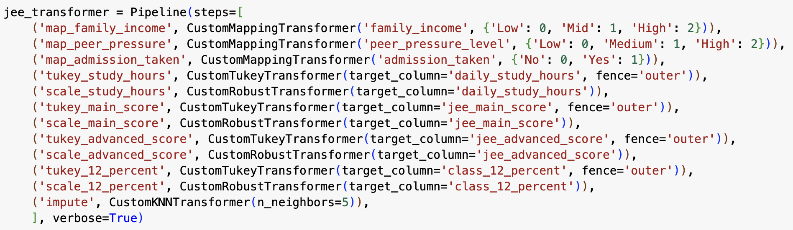

# JEE Data Pipeline Documentation

## Pipeline Overview

This pipeline preprocesses the JEE dataset to prepare it for machine learning modeling. It performs column filtering, categorical encoding, outlier detection and treatment, feature scaling, and missing value imputation.

---

## Pipeline Diagram

---

## Step-by-Step Design Choices

### 1. Column Selection (`drop_cols`)
- **Transformer**: `CustomDropColumnsTransformer(column_list=['daily_study_hours', 'family_income', 'peer_pressure_level', 'admission_taken'], action='keep')`
- **Design Choice**: Retain only a selected subset of relevant features  
- **Rationale**:  
  - Focuses modeling efforts on features with strong predictive value  
  - Removes irrelevant or redundant features to reduce noise and improve generalization  

---

### 2. Family Income Mapping (`map_family_income`)
- **Transformer**: `CustomMappingTransformer('family_income', {'Low': 0, 'Mid': 1, 'High': 2})`
- **Design Choice**: Ordinal encoding of family income from low to high  
- **Rationale**:  
  - Reflects the inherent order in income levels  
  - Maintains numerical relationships between categories for downstream models  

---

### 3. Peer Pressure Level Mapping (`map_peer_pressure`)
- **Transformer**: `CustomMappingTransformer('peer_pressure_level', {'Low': 0, 'Medium': 1, 'High': 2})`
- **Design Choice**: Ordinal encoding of peer pressure level  
- **Rationale**:  
  - Captures increasing levels of peer pressure as numeric values  
  - Preserves natural order and reduces dimensionality compared to one-hot encoding  

---

### 4. Admission Taken Mapping (`map_admission_taken`)
- **Transformer**: `CustomMappingTransformer('admission_taken', {'No': 0, 'Yes': 1})`
- **Design Choice**: Binary encoding of admission status  
- **Rationale**:  
  - Simple binary mapping of yes/no decision  
  - Reduces complexity and maintains interpretability  

---

### 5. Outlier Treatment for Daily Study Hours (`tukey_study_hours`)
- **Transformer**: `CustomTukeyTransformer(target_column='daily_study_hours', fence='outer')`
- **Design Choice**: Tukey method with outer fence for detecting extreme outliers  
- **Rationale**:  
  - Identifies and treats only extreme study hour outliers  
  - Outer fence (`Q1 - 3×IQR`, `Q3 + 3×IQR`) is conservative and retains moderate variation  

---

### 6. Study Hours Scaling (`scale_study_hours`)
- **Transformer**: `CustomRobustTransformer(target_column='daily_study_hours')`
- **Design Choice**: Robust scaling of daily study hours  
- **Rationale**:  
  - Mitigates influence of outliers on scaling  
  - Uses median and IQR, which are more robust than mean and standard deviation  

---

### 7. Imputation (`impute`)
- **Transformer**: `CustomKNNTransformer(n_neighbors=5)`
- **Design Choice**: KNN imputation using 5 nearest neighbors  
- **Rationale**:  
  - Fills missing values based on similarity with other samples  
  - `k=5` balances stability and flexibility  
  - Outperforms mean/median imputation when features are correlated  

---

## Pipeline Execution Order Rationale

1. **Column selection**: Establishes which features to process  
2. **Categorical encoding**: Prepares data for numerical processing  
3. **Outlier treatment**: Handles extreme values before scaling  
4. **Scaling**: Normalizes feature values for consistency  
5. **Imputation**: Final step, uses clean and scaled data for accurate estimation of missing values  

---

## Performance Considerations

- **Ordinal and binary mappings**: Reduce dimensionality and preserve relationships  
- **Tukey outlier treatment**: Conservative approach avoids over-trimming  
- **RobustScaler**: More appropriate than `StandardScaler` due to skew and outliers  
- **KNN Imputation**: Maintains inter-feature relationships for better imputations  
